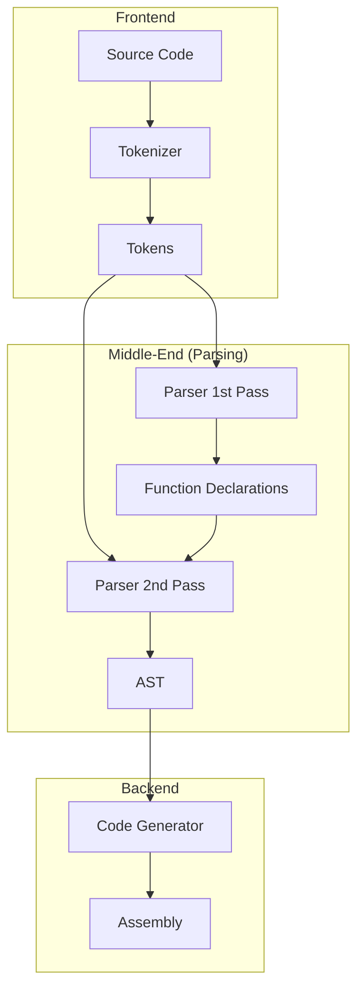

# Quark Language Compiler

A custom compiler for the Quark programming language, targeting x86-64 architecture.

## Prerequisites

Ensure the following tools are installed on your system:

* **GNU Make**: For build automation.
* **NASM**: Netwide Assembler for generating executable machine code.
* **ld**: The GNU linker.

## Getting Started

### Building the Project

To build the compiler from source:

```bash
cd compiler
make

```

### Usage

Run the compiler against a Quark source file (`.qk`):

```bash
./quark <filename>.qk <architecture> <output assembly and executable file name>

```

**System Compatibility**

| OS | Architecture | Status |
| --- | --- | --- |
| Linux | **x86-64** | ✅ Supported |
| Linux | ARM64 | 🚧 Planned |

## Language Reference

### Variables

Variables are strongly typed and defined using the `let` keyword. Identifiers must follow standard C-style naming conventions (alphanumeric and underscores only, cannot start with a number).

```rust
let my_var: int = 10;
let _temp: int = 5;
```

Assignments also follow C-style assignments
```rust
let my_var: int = 10;
my_var = my_var + 3 * 2; // now my_var = 10 + 3 * 2 = 16
```

### Control Flow

Quark supports standard conditional logic and loops.

**If Statements**

```rust
if (x > 10) {
    exit 1;
}

// Single line syntax is also supported:
if (x == 0) exit 0;
```

**While Loops**

```rust
while (x < 10) {
    x = x + 1;
    if (x == 5) {
        break; // Exit loop
    }
}
```

### Functions

Functions are declared using the `fn` keyword. You must specify parameter types and the return type.

```rust
fn add(a: int, b: int): int {
    return a + b;
}
```

Functions may also be recursive

```rust
fn add(a: int, b: int): int {
    if ((a + b) < 10) {
        return a + b;
    }
    else {
        // Example of a recursive call passing two arguments
        return add(a + 1, b + 1); 
    }
}
```

Functions are called using their name

```rust
let x: int = 5;
let y: int = 2;
let z: int = add(x, y); // z now = 7
```

### System Operations

**Exit**
Terminate the program with a status code (0-255).

```rust
exit 0;
```

## Optimizations

| Optimization |  Status |
| --- |--- |
| Path Exahuastion | ✅ Supported |
| Dead Code Elimination | ✅ Supported |
| Tail Call Recursion | 🚧 Planned |
| Constant Folding | 🚧 Planned |
| Loop Unfolding | 🚧 Planned |




## Plans
### Short-Term (Near Future)
- [ ] Support for `float` data types
- [ ] Tail call recursion Optimization
- [ ] Constant Folding
- [ ] Arrays
- [ ] library integration


### Long-Term (Future Goals)
- [ ] **ARM64** Architecture support
- [ ] Standard Library (File I/O, String manipulation, Math)
- [ ] Structs
- [ ] SIMD optimizations


## Architecture decisions
- Arenas:
    Used Arenas for O(1) deallocation and the prevention of memory leaks.

- Multi-Pass Design:
    Implemented a multi-pass compiler pipeline (lexing → parsing → semantic analysis → IR → codegen) to keep each phase isolated, testable, and easier to extend with optimizations later.

- Minimal dependencies:
    Avoided third-party libraries to keep the compiler portable, auditable, and easy to bootstrap.