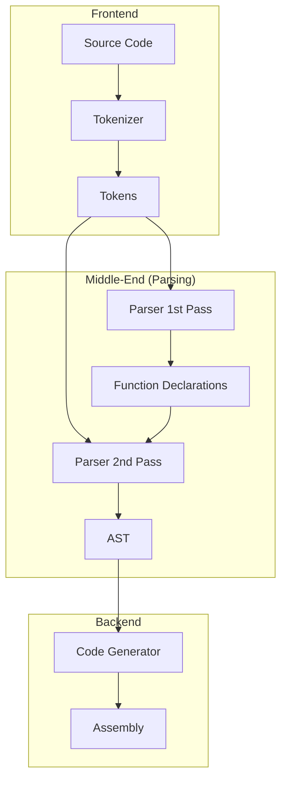

# Quark Language Compiler

A compiler for the Quark programming language, targeting x86-64 architecture.

## Prerequisites

- **GNU Make** for build automation
- **NASM** (Netwide Assembler) for generating machine code
- **ld** (GNU linker)

## Getting Started

### Building

```bash
cd compiler
make
```

### Usage

```bash
./quark <filename>.qk <architecture> <output_name>
```

This produces `<output_name>.asm` and links it into an executable named `<output_name>`.

### Architecture Support

| OS    | Architecture | Status    |
|-------|-------------|-----------|
| Linux | x86-64      | Supported |
| Linux | ARM64       | Planned   |

---

## Language Reference

### Entry Point

Every Quark program must define a `main` function. Execution begins at `main`, and its return value is used as the program's exit code.

```rust
fn main(void): int {
    return 0;
}
exit main();
```

The `exit main();` call at the top level is required — it tells the runtime to invoke `main` and forward its return value to the OS. A program without a `main` function will not compile.

### Data Types

| Type   | Size    |
|--------|---------|
| `int`  | 4 bytes |
| `long` | 8 bytes |
| `*T`   | 8 bytes (pointer to T) |

### Variables

Variables are strongly typed and declared with the `let` keyword.

```rust
let x: int = 10;
let y: long = 100;
```

Reassignment uses standard C-style syntax.

```rust
x = x + 3 * 2;
```

### Pointers

Take the address of a variable with `&` and dereference with `.*`.

```rust
let x: int = 42;
let p: *int = &x;
let val: int = p.*;      // val = 42

let pp: **int = &p;
let val2: int = pp.*.*;  // val2 = 42
```

### Control Flow

**If / Else**

```rust
if (x > 10) {
    return 1;
} else if (x == 10) {
    return 2;
} else {
    return 3;
}
```

Single-line form is also valid.

```rust
if (x == 0) exit 0;
```

**While**

```rust
while (x < 10) {
    x = x + 1;
    if (x == 5) {
        break;
    }
}
```

### Functions

Functions are declared with `fn`, require typed parameters, and must declare a return type. A function with no parameters uses `void`.

```rust
fn add(a: int, b: int): int {
    return a + b;
}

fn get_constant(void): int {
    return 42;
}
```

Recursive functions are supported.

```rust
fn factorial(n: int): int {
    if (n <= 1) { return 1; }
    return n * factorial(n - 1);
}
```

Function calls can be used in expressions.

```rust
let result: int = add(3, factorial(5));
```

### Exit

Terminate the program immediately with a status code (0–255).

```rust
exit 0;
```

---

## Optimizations

| Optimization          | Status    |
|-----------------------|-----------|
| Path Exhaustion       | Supported |
| Dead Code Elimination | Supported |
| Escape Analysis       | Supported |
| Constant Folding      | Planned   |
| Tail Call Recursion   | Planned   |
| Loop Unrolling        | Planned   |

---

## Compiler Pipeline


```mermaid
graph TD
    subgraph Frontend
        A[Source Code] --> B[Tokenizer]
        B --> C[Tokens]
    end

    subgraph "Middle-End (Parsing)"
        C --> D[Parser 1st Pass]
        D --> E[Function Declarations]
        C --> F[Parser 2nd Pass]
        E --> F
        F --> G[AST]
    end

    subgraph Backend
        G --> H[Code Generator]
        H --> I[Assembly]
    end
```

---

## Plans

### Short-Term
- Arrays
- Structs
- Support for `float` data types
- Constant folding
- Tail call recursion optimization
- Library integration

### Long-Term
- ARM64 architecture support
- Standard library (file I/O, string manipulation, math)
- SIMD optimizations

---

## Architecture Decisions

**Arenas** — all allocations go through arena allocators, giving O(1) deallocation and eliminating the risk of memory leaks across compilation phases.

**Multi-pass design** — the pipeline is split into discrete phases (lexing, parsing, semantic analysis, codegen) so each phase is isolated, independently testable, and easier to extend with optimizations later.

**Minimal dependencies** — no third-party libraries. The compiler is self-contained, easy to bootstrap, and has no external build requirements beyond a C compiler, NASM, and ld.